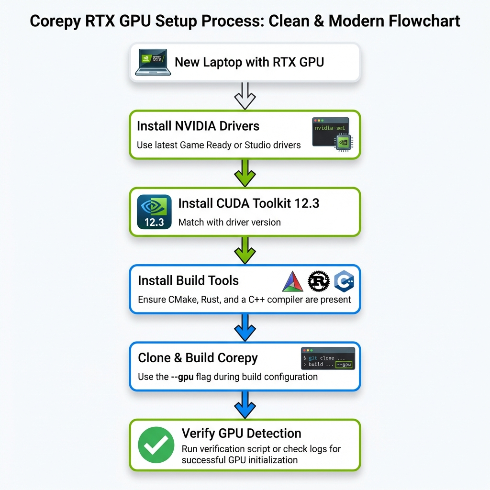

# 🎮 GPU Setup Guide (RTX 2000/3000/4000/5000 Series)

This guide will help you set up **Corepy** on a laptop or workstation with an **NVIDIA RTX GPU** (2000, 3000, 4000, or 5000 series). 

> [!NOTE]
> Corepy supports **RTX 2050, RTX 3060, RTX 4090**, and all other RTX 2000/3000/4000/5000 series GPUs.

---

## 📋 Prerequisites

Before you begin, ensure you have:

1. **NVIDIA RTX GPU** (2000/3000/4000/5000 series)
   - Examples: RTX 2050, RTX 2060, RTX 3060, RTX 3080, RTX 4060, RTX 4090, RTX 5090
2. **Linux Operating System** (Ubuntu 20.04+ recommended)
3. **Python 3.10 or newer**
4. **Administrator/sudo access** (for driver installation)

---

## 📊 Setup Process Overview



---

## 🚀 Step-by-Step Installation

### Step 1: Install NVIDIA Drivers

First, check if you already have NVIDIA drivers installed:

```bash
nvidia-smi
```

If this command works and shows your GPU information, you can skip to **Step 2**.

Otherwise, install the NVIDIA drivers:

#### Ubuntu/Debian:
```bash
# Add NVIDIA PPA repository
sudo add-apt-repository ppa:graphics-drivers/ppa
sudo apt update

# Install recommended driver (let Ubuntu choose the best version)
sudo ubuntu-drivers autoinstall

# OR install a specific version (e.g., 545)
sudo apt install nvidia-driver-545

# Reboot your system
sudo reboot
```

#### Fedora/RHEL:
```bash
# Add RPM Fusion repository
sudo dnf install https://download1.rpmfusion.org/free/fedora/rpmfusion-free-release-$(rpm -E %fedora).noarch.rpm
sudo dnf install https://download1.rpmfusion.org/nonfree/fedora/rpmfusion-nonfree-release-$(rpm -E %fedora).noarch.rpm

# Install NVIDIA driver
sudo dnf install akmod-nvidia

# Reboot your system
sudo reboot
```

After rebooting, verify the installation:
```bash
nvidia-smi
```

You should see output showing your GPU (e.g., "NVIDIA GeForce RTX 2050").

---

### Step 2: Install CUDA Toolkit

Corepy requires **CUDA 11.8 or newer** (CUDA 12.x recommended for RTX 4000/5000 series).

#### Ubuntu/Debian:

```bash
# Download and install CUDA 12.3 (recommended)
wget https://developer.download.nvidia.com/compute/cuda/repos/ubuntu2204/x86_64/cuda-keyring_1.1-1_all.deb
sudo dpkg -i cuda-keyring_1.1-1_all.deb
sudo apt-get update
sudo apt-get -y install cuda-toolkit-12-3

# Add CUDA to your PATH
echo 'export PATH=/usr/local/cuda-12.3/bin:$PATH' >> ~/.bashrc
echo 'export LD_LIBRARY_PATH=/usr/local/cuda-12.3/lib64:$LD_LIBRARY_PATH' >> ~/.bashrc
source ~/.bashrc
```

#### Verify CUDA Installation:
```bash
nvcc --version
```

You should see output like:
```
Cuda compilation tools, release 12.3, V12.3.XXX
```

---

### Step 3: Install Build Dependencies

Corepy needs CMake, C++ compiler, and Rust:

```bash
# Install build essentials and CMake
sudo apt-get install build-essential cmake pkg-config

# Install Rust (if not already installed)
curl --proto '=https' --tlsv1.2 -sSf https://sh.rustup.rs | sh
source $HOME/.cargo/env
```

---

### Step 4: Clone and Build Corepy

```bash
# Clone the repository
git clone https://github.com/ai-foundation-software/corepy.git
cd corepy

# Create a virtual environment
python3 -m venv .venv
source .venv/bin/activate

# Install Python dependencies
pip install --upgrade pip
pip install -r requirements-base.txt

# Build C++ kernels with CUDA support
cd csrc
cmake -B build -DUSE_CUDA=ON -DCMAKE_CUDA_ARCHITECTURES=75,86,89
cmake --build build -j$(nproc)
cd ..

# Install Corepy (editable mode)
pip install -e .
```

> [!IMPORTANT]
> The `-DCMAKE_CUDA_ARCHITECTURES` flag specifies which GPU architectures to compile for:
> - **RTX 2000 series** (RTX 2050, 2060, 2070, 2080): `75`
> - **RTX 3000 series** (RTX 3060, 3070, 3080, 3090): `86`
> - **RTX 4000 series** (RTX 4060, 4070, 4080, 4090): `89`
> - **RTX 5000 series** (RTX 5090): `90`
>
> To support all, use: `-DCMAKE_CUDA_ARCHITECTURES=75,86,89,90`

---

## ✅ Verify GPU Support

After installation, verify that Corepy can detect your GPU:

```python
import corepy as cp

# Check device information
device_info = cp.get_device_info()
print(f"GPU Count: {device_info.gpu_count}")
print(f"GPU Names: {device_info.gpu_names}")
print(f"Has GPU: {device_info.has_gpu}")
```

Expected output:
```
GPU Count: 1
GPU Names: ['CUDA Device 0']
Has GPU: True
```

---

## 🧪 Test GPU Performance

Run a simple benchmark to confirm GPU acceleration is working:

```python
import corepy as cp
import numpy as np
import time

# Create large matrices
size = 4096
a = cp.Tensor(np.random.rand(size, size))
b = cp.Tensor(np.random.rand(size, size))

# Force GPU backend
cp.set_backend_policy('gpu')

# Benchmark matrix multiplication
start = time.time()
c = cp.matmul(a, b)
gpu_time = time.time() - start

print(f"GPU Time: {gpu_time:.4f} seconds")

# Check which backend was used
print(cp.explain_last_dispatch())
```

---

## 🔧 Troubleshooting

### Issue 1: "CUDA not found" during build

**Solution:**
Ensure CUDA is in your PATH:
```bash
export PATH=/usr/local/cuda/bin:$PATH
export LD_LIBRARY_PATH=/usr/local/cuda/lib64:$LD_LIBRARY_PATH
```

Add these lines to your `~/.bashrc` to make them permanent.

---

### Issue 2: "No GPU detected" at runtime

**Solution:**
1. Check if `nvidia-smi` works
2. Verify CUDA libraries are accessible:
   ```bash
   ldconfig -p | grep cuda
   ```
3. Ensure you built Corepy with `-DUSE_CUDA=ON`

---

### Issue 3: "CUDA out of memory" error

**Solution:**
- Your GPU doesn't have enough VRAM for the operation
- Reduce matrix/tensor sizes
- Use smaller batch sizes

---

### Issue 4: Wrong GPU architecture compiled

**Symptom:** GPU code runs but is very slow

**Solution:**
Rebuild with the correct architecture for your GPU:

```bash
cd csrc
rm -rf build  # Clean previous build
cmake -B build -DUSE_CUDA=ON -DCMAKE_CUDA_ARCHITECTURES=XX
cmake --build build -j$(nproc)
```

Replace `XX` with your GPU's compute capability:
- RTX 2050: `75`
- RTX 3060: `86`
- RTX 4090: `89`

---

## 📊 GPU Architecture Reference

| GPU Series | Model Examples | Compute Capability | CMake Flag |
|:-----------|:--------------|:------------------|:-----------|
| RTX 2000 | 2050, 2060, 2070, 2080 | 7.5 | `75` |
| RTX 3000 | 3060, 3070, 3080, 3090 | 8.6 | `86` |
| RTX 4000 | 4060, 4070, 4080, 4090 | 8.9 | `89` |
| RTX 5000 | 5090 | 9.0 | `90` |

---

## 🎯 Environment Variables

You can control GPU usage with environment variables:

```bash
# Force GPU backend
export COREPY_BACKEND=gpu

# Force CPU backend (even if GPU is available)
export COREPY_BACKEND=cpu

# Set GPU device (if you have multiple GPUs)
export CUDA_VISIBLE_DEVICES=0
```

---

## 🚢 Deploying to Another Machine

To use Corepy on **another laptop with RTX GPU**:

### Option 1: Install from Source (Recommended)

1. Follow **Steps 1-4** above on the target machine
2. Make sure CUDA is installed and matches your GPU architecture
3. Build with the correct `-DCMAKE_CUDA_ARCHITECTURES` flag

### Option 2: Copy Pre-built Binaries (Advanced)

> [!CAUTION]
> This only works if both machines have:
> - Same OS and kernel version
> - Same CUDA version
> - Same GPU architecture

1. On the source machine, build the project
2. Package the built files:
   ```bash
   cd corepy
   tar czf corepy-gpu.tar.gz \
     corepy/ \
     csrc/build/ \
     rust/target/release/ \
     setup.py \
     pyproject.toml
   ```
3. Transfer to target machine and extract:
   ```bash
   tar xzf corepy-gpu.tar.gz
   cd corepy
   pip install -e .
   ```

---

## 📚 Additional Resources

- [NVIDIA CUDA Installation Guide](https://docs.nvidia.com/cuda/cuda-installation-guide-linux/)
- [Corepy Architecture Documentation](../03_architecture/architecture.md)
- [Performance Tuning Guide](../02_core_concepts/performance_analysis.md)

---

## ℹ️ Notes

- **RTX 2050** users: Your GPU has 4GB VRAM, so keep matrix sizes reasonable (≤ 8192×8192)
- **RTX 3060** users: 12GB VRAM allows larger operations
- **RTX 4090** users: 24GB VRAM enables massive computations

For questions or issues, please open an issue on [GitHub](https://github.com/ai-foundation-software/corepy/issues).
