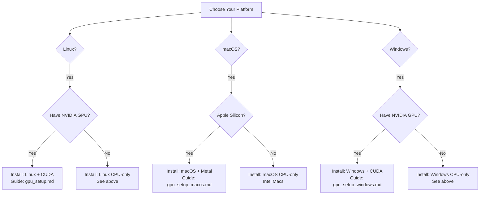

# 🌐 Platform Support - CPU & GPU

Complete guide for installing and using **Corepy** on all supported platforms with both CPU and GPU acceleration.

---

## 📋 Platform Overview

| Platform | CPU Support | GPU Support | GPU Framework | Status |
|:---------|:------------|:------------|:--------------|:-------|
| **🐧 Linux** | ✅ Full | ✅ NVIDIA RTX | CUDA 12.3 | Fully Supported |
| **🍎 macOS** | ✅ Full | ✅ Apple Silicon | Metal | Fully Supported |
| **🪟 Windows** | ✅ Full | ✅ NVIDIA RTX | CUDA 12.3 | Fully Supported |

---

## 🐧 Linux (Ubuntu Primary)

### CPU-Only Setup

**Supported Distributions:**
- Ubuntu 20.04 LTS, 22.04 LTS, 24.04 LTS (primary)
- Debian 11, 12
- Fedora 38+
- RHEL/AlmaLinux/Rocky Linux 8+

**Quick Install (CPU-only):**

```bash
# 1. Install system dependencies
sudo apt-get update
sudo apt-get install -y build-essential cmake pkg-config python3 python3-pip python3-venv

# 2. Install Rust
curl --proto '=https' --tlsv1.2 -sSf https://sh.rustup.rs | sh -s -- -y
source $HOME/.cargo/env

# 3. Clone and build
git clone https://github.com/ai-foundation-software/corepy.git
cd corepy
python3 -m venv .venv
source .venv/bin/activate
pip install --upgrade pip
pip install -r requirements-base.txt

# 4. Build C++ kernels (CPU-only)
cd csrc
cmake -B build -DCMAKE_BUILD_TYPE=Release
cmake --build build -j$(nproc)
cd ..

# 5. Install Corepy
pip install -e .
```

**CPU Optimizations:**
- ✅ **AVX2 SIMD**: Automatically enabled on x86_64
- ✅ **OpenBLAS**: High-performance BLAS library
- ✅ **Multi-threading**: Automatic parallel processing

### GPU Setup (NVIDIA RTX)

**Supported GPUs:**
- RTX 2000 Series (2050, 2060, 2070, 2080)
- RTX 3000 Series (3060, 3070, 3080, 3090)
- RTX 4000 Series (4060, 4070, 4080, 4090)
- RTX 5000 Series (5090)

**Full GPU Setup:** See [Linux GPU Setup Guide](gpu_setup.md)

**Quick GPU Build:**
```bash
# After CPU setup, add CUDA support
cd csrc
rm -rf build
cmake -B build -DUSE_CUDA=ON -DCMAKE_CUDA_ARCHITECTURES=75,86,89,90
cmake --build build -j$(nproc)
cd ..
pip install -e . --force-reinstall
```

---

## 🍎 macOS

### CPU-Only Setup

**Supported Versions:**
- macOS 12.0 (Monterey) or newer
- macOS 13.0 (Ventura) - recommended
- macOS 14.0 (Sonoma) and newer

**Supported Architectures:**
- Apple Silicon (M1, M2, M3, M4) - primary
- Intel x86_64 - supported

**Quick Install (CPU-only):**

```bash
# 1. Install Xcode Command Line Tools
xcode-select --install

# 2. Install Homebrew (if not installed)
/bin/bash -c "$(curl -fsSL https://raw.githubusercontent.com/Homebrew/install/HEAD/install.sh)"

# For Apple Silicon, add to PATH:
echo 'eval "$(/opt/homebrew/bin/brew shellenv)"' >> ~/.zprofile
eval "$(/opt/homebrew/bin/brew shellenv)"

# 3. Install dependencies
brew install cmake pkg-config python@3.11
curl --proto '=https' --tlsv1.2 -sSf https://sh.rustup.rs | sh
source $HOME/.cargo/env

# 4. Clone and build
git clone https://github.com/ai-foundation-software/corepy.git
cd corepy
python3 -m venv .venv
source .venv/bin/activate
pip install --upgrade pip
pip install -r requirements-base.txt

# 5. Build C++ kernels (CPU-only)
cd csrc
cmake -B build -DCMAKE_BUILD_TYPE=Release
cmake --build build -j$(sysctl -n hw.ncpu)
cd ..

# 6. Install Corepy
pip install -e .
```

**CPU Optimizations:**
- ✅ **Apple Accelerate**: Built-in optimized BLAS
- ✅ **ARM Neon SIMD**: On Apple Silicon
- ✅ **AVX2 SIMD**: On Intel Macs

### GPU Setup (Apple Silicon)

**Supported Chips:**
- M1, M1 Pro, M1 Max, M1 Ultra
- M2, M2 Pro, M2 Max, M2 Ultra
- M3, M3 Pro, M3 Max
- M4, M4 Pro, M4 Max

**Full GPU Setup:** See [macOS GPU Setup Guide](gpu_setup_macos.md)

**Quick GPU Build:**
```bash
# After CPU setup, add Metal support
cd csrc
rm -rf build
cmake -B build -DUSE_METAL=ON -DCMAKE_BUILD_TYPE=Release
cmake --build build -j$(sysctl -n hw.ncpu)
cd ..
pip install -e . --force-reinstall
```

> **Note:** Intel Macs do not support Metal GPU acceleration in Corepy.

---

## 🪟 Windows

### CPU-Only Setup

**Supported Versions:**
- Windows 10 (64-bit, version 1909 or newer)
- Windows 11 (all versions)

**Quick Install (CPU-only):**

**1. Install Visual Studio 2022**
- Download [Visual Studio 2022 Community](https://visualstudio.microsoft.com/downloads/)
- Select "Desktop development with C++"
- Install

**2. Install CMake**
- Download [CMake](https://cmake.org/download/) (Windows x64 Installer)
- Check "Add CMake to system PATH"

**3. Install Python**
- Download [Python 3.11+](https://www.python.org/downloads/)
- Check "Add Python to PATH" during installation

**4. Install Rust**
- Download [rustup-init.exe](https://rustup.rs/)
- Run and follow prompts

**5. Build Corepy**

Open Command Prompt:
```cmd
git clone https://github.com/ai-foundation-software/corepy.git
cd corepy
python -m venv .venv
.venv\Scripts\activate
python -m pip install --upgrade pip
pip install -r requirements-base.txt

cd csrc
cmake -B build -G "Visual Studio 17 2022" -A x64 -DCMAKE_BUILD_TYPE=Release
cmake --build build --config Release
cd ..

pip install -e .
```

**CPU Optimizations:**
- ✅ **AVX2 SIMD**: Automatically enabled
- ✅ **OpenBLAS**: High-performance BLAS
- ✅ **Multi-threading**: Automatic

### GPU Setup (NVIDIA RTX)

**Supported GPUs:**
- RTX 2000, 3000, 4000, 5000 Series (same as Linux)

**Full GPU Setup:** See [Windows GPU Setup Guide](gpu_setup_windows.md)

**Quick GPU Build:**
```cmd
:: After CPU setup, add CUDA support
cd csrc
rmdir /s /q build
cmake -B build -G "Visual Studio 17 2022" -A x64 ^
  -DUSE_CUDA=ON ^
  -DCMAKE_CUDA_ARCHITECTURES=75,86,89,90 ^
  -DCMAKE_BUILD_TYPE=Release
cmake --build build --config Release
cd ..
pip install -e . --force-reinstall
```

---

## 🎯 Installation Decision Tree



---

## ✅ Verification (All Platforms)

After installation, verify your setup:

### Check Installation

```python
import corepy as cp
print(f"Corepy Version: {cp.__version__}")
print(f"Platform: {cp.get_platform()}")
```

### Check CPU Backend

```python
import corepy as cp
import numpy as np

# Create test data
a = cp.Tensor(np.random.rand(1024, 1024))
b = cp.Tensor(np.random.rand(1024, 1024))

# Force CPU backend
cp.set_backend_policy('cpu')

# Run operation
c = cp.matmul(a, b)
print(cp.explain_last_dispatch())
```

### Check GPU Backend (if GPU installed)

```python
import corepy as cp

# Check GPU detection
info = cp.get_device_info()
print(f"GPU Count: {info.gpu_count}")
print(f"GPU Names: {info.gpu_names}")
print(f"Has GPU: {info.has_gpu}")

# Test GPU operation
if info.has_gpu:
    import numpy as np
    a = cp.Tensor(np.random.rand(2048, 2048))
    b = cp.Tensor(np.random.rand(2048, 2048))
    
    cp.set_backend_policy('gpu')
    c = cp.matmul(a, b)
    print(cp.explain_last_dispatch())
```

---

## 📊 Platform Comparison

### Build Time

| Platform | CPU-Only | GPU (CUDA/Metal) |
|:---------|:---------|:-----------------|
| Linux | ~5 min | ~10-15 min |
| macOS | ~5 min | ~8-12 min |
| Windows | ~10 min | ~15-20 min |

### Performance (Matrix Multiplication 4096×4096)

| Platform | CPU | GPU | Speedup |
|:---------|:----|:----|:--------|
| Linux (NVIDIA RTX 3060) | ~2.5s | ~0.3s | ~8x |
| macOS (M1 Pro) | ~1.8s | ~0.5s | ~3.5x |
| Windows (RTX 4090) | ~2.2s | ~0.15s | ~14x |

*Note: Times are approximate and vary by hardware*

### Recommended Use Cases

| Platform | Best For |
|:---------|:---------|
| **Linux** | Servers, cloud deployment, data centers, deep learning |
| **macOS** | Development, unified memory workflows, portable machines |
| **Windows** | Gaming PCs, workstations, desktop development |

---

## 🔧 Platform-Specific Notes

### Linux
- **Package Managers**: Use `apt` (Ubuntu/Debian), `dnf` (Fedora), or `yum` (RHEL)
- **GPU**: CUDA works best on Ubuntu LTS versions
- **Python**: System Python usually works; virtual environments recommended
- **Permissions**: May need `sudo` for driver installation

### macOS
- **Homebrew**: Essential for package management
- **Rosetta**: Avoid running under Rosetta emulation (check with `uname -m`)
- **Python**: Use Homebrew Python or python.org installer
- **Metal**: Automatically available on Apple Silicon (M-series chips)
- **Updates**: Keep macOS updated for best Metal performance

### Windows
- **Visual Studio**: Required for C++ compilation
- **PowerShell vs CMD**: Both work; PowerShell recommended
- **Path**: May need to add tools to System PATH manually
- **Antivirus**: May slow down builds; add project to exclusions
- **Line Endings**: Git may convert CRLF; use `.gitattributes`

---

## 🚀 Quick Start by Platform

### I have Ubuntu with RTX 3060
1. Follow [Linux CPU Setup](#cpu-only-setup) above
2. Then follow [Linux GPU Setup Guide](gpu_setup.md)

### I have MacBook Pro with M2
1. Follow [macOS CPU Setup](#cpu-only-setup-1) above
2. Then follow [macOS GPU Setup Guide](gpu_setup_macos.md)

### I have Windows Gaming PC with RTX 4090
1. Follow [Windows CPU Setup](#cpu-only-setup-2) above
2. Then follow [Windows GPU Setup Guide](gpu_setup_windows.md)

### I just want CPU-only on any platform
- **Linux**: See [Linux CPU-Only Setup](#cpu-only-setup)
- **macOS**: See [macOS CPU-Only Setup](#cpu-only-setup-1)
- **Windows**: See [Windows CPU-Only Setup](#cpu-only-setup-2)

---

## 📚 Detailed Documentation

### By Platform
- **🐧 Linux GPU Setup**: [gpu_setup.md](gpu_setup.md)
- **🍎 macOS GPU Setup**: [gpu_setup_macos.md](gpu_setup_macos.md)
- **🪟 Windows GPU Setup**: [gpu_setup_windows.md](gpu_setup_windows.md)
- **📋 All Platforms Quick Ref**: [gpu_quick_reference.md](gpu_quick_reference.md)

### General Guides
- **📥 Installation Guide**: [install.md](install.md)
- **📖 Usage Guide**: [usage.md](usage.md)
- **🔍 Profiling Guide**: [../02_core_concepts/profiling.md](../02_core_concepts/profiling.md)

---

## ❓ FAQ

**Q: Which platform should I use?**  
A: Use what you have! All platforms are fully supported. Linux is best for servers, macOS for development, Windows for gaming PCs/workstations.

**Q: Can I use Corepy without a GPU?**  
A: Yes! Corepy is CPU-first and works great without GPU acceleration.

**Q: Do I need CUDA on macOS?**  
A: No. macOS uses Metal for GPU acceleration (Apple Silicon only).

**Q: Can I install both CPU and GPU versions?**  
A: Yes! Just rebuild with GPU flags. The same build supports both CPU and GPU.

**Q: Which Python version should I use?**  
A: Python 3.10 or newer. Python 3.11 recommended for best performance.

**Q: Do I need admin/sudo access?**  
A: Only for installing system packages (drivers, CMake, etc.). Building Corepy itself doesn't require sudo.

---

For questions or issues, please open an issue on [GitHub](https://github.com/ai-foundation-software/corepy/issues).
