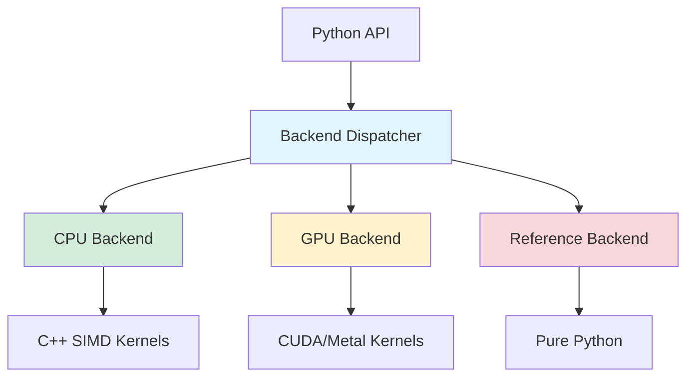

# Backend Architecture: Rust Runtime & Device Management

**Version**: 0.2.0  
**Focus**: CPU/GPU Backend Selection, Rust Runtime Design  
**Audience**: Contributors, Advanced Users

---

## Overview

Corepy uses a **multi-layered backend architecture** designed for:
1. **Device Abstraction**: Seamless CPU/GPU selection
2. **Safety**: Rust's ownership model prevents data races
3. **Performance**: Zero-cost abstractions for backend dispatch
4. **Extensibility**: Plugin system for custom backends



---

## 🎯 Backend Types

### 1. CPU Backend (Default, v1)
**Implementation**: C++ with SIMD optimizations  
**Status**: ✅ Active in v1

```python
from corepy.backend import CPUBackend, CPUDevice

# CPU backend is auto-selected by default
backend = CPUBackend()
device = CPUDevice(device_id=0)

print(f"Backend: {backend}")
print(f"Device: {device}")
```

**Features**:
- AVX2/AVX-512 SIMD instruction support (Intel)
- NEON support (ARM/Apple Silicon)
- Multi-threaded execution (planned for v1.1)
- Memory-aligned allocations for cache efficiency

### 2. GPU Backend (v2+)
**Implementation**: CUDA (NVIDIA) / Metal (Apple) / ROCm (AMD)  
**Status**: ⚠️ Planned for v2

```python
# Future API (not yet implemented)
from corepy.backend import GPUBackend, GPUDevice

# This will work in v2
backend = GPUBackend()
device = GPUDevice(device_id=0)  # First GPU
```

### 3. Reference Backend
**Implementation**: Pure Python  
**Status**: ⚠️ Exists in source but not exposed in v1

**Purpose**: Gold standard for correctness testing

```python
# Not exposed in current release, but exists in source
# Located at: corepy/backend/reference.py

# Future API:
from corepy.backend import ReferenceBackend

result = ReferenceBackend.add([1, 2, 3], [4, 5, 6])
# Output: [5, 7, 9]
```

---

## 🔍 Device Detection System

Corepy automatically detects available hardware at runtime.

### Detecting System Capabilities

```python
from corepy.backend import detect_devices

# Get comprehensive device information
info = detect_devices()

print(f"CPU Cores: {info.cpu_cores}")
print(f"Has AVX2: {info.has_avx2}")
print(f"Has AVX-512: {info.has_avx512}")
print(f"Has NEON: {info.has_neon}")
print(f"GPU Count: {info.gpu_count}")
print(f"Platform: {info.platform_system}")
```

**Example Output (Linux x86_64)**:
```
CPU Cores: 4
Has AVX2: True
Has AVX-512: False
Has NEON: False
GPU Count: 0
Platform: Linux
```

**Example Output (Apple M1)**:
```
CPU Cores: 8
Has AVX2: False
Has AVX-512: False
Has NEON: True
GPU Count: 1
Platform: Darwin
```

### Device Information Structure

```python
from typing import Optional, List

@dataclass
class DeviceInfo:
    """System device capabilities detected at runtime."""
    
    # CPU Information
    cpu_cores: int
    memory_limit_bytes: Optional[int]
    has_avx2: bool
    has_avx512: bool
    has_neon: bool
    
    # GPU Information
    gpu_count: int
    gpu_names: List[str]
    gpu_memory_bytes: List[int]
    
    # System
    platform_system: str  # "Linux", "Darwin", "Windows"
    forced_backend: Optional[str]
```

---

## 🧩 Backend Selection Logic

### Automatic Selection (Recommended)

```python
import corepy as cp

# Backend selected automatically based on:
# 1. Available hardware
# 2. Operation type
# 3. Data size
# 4. User preferences

tensor = cp.Tensor([1, 2, 3])
result = tensor + cp.Tensor([4, 5, 6])
# Automatically uses CPU backend in v1
```

### Manual Backend Selection

```python
from corepy.backend import select_backend, OperationProperties, detect_devices

# Define operation properties
op_props = OperationProperties(
    op_type="elementwise_add",
    input_size_bytes=1024,
    requires_gpu=False
)

# Get device info
device_info = detect_devices()

# Select optimal backend
backend = select_backend(
    backend_name="cpu",
    op_props=op_props,
    device_info=device_info
)

print(f"Selected: {backend}")
```

### Backend Priority Chain (v2+)

**Future implementation** will support fallback chains:

```python
# Planned API for v2
cp.set_backend_priority(["gpu", "cpu", "reference"])

# Execution logic:
# 1. Try GPU → if available and operation supported
# 2. Fallback to CPU → if GPU unavailable or operation not supported
# 3. Fallback to Reference → for debugging/validation
```

---

## 🦀 Rust Runtime Layer

### Design Philosophy

The Rust runtime provides:
1. **Memory Safety**: No segfaults, no data races
2. **Concurrency**: Work-stealing task scheduler
3. **Zero-Cost**: Abstractions compiled away
4. **FFI Bridge**: Safe Python ↔ C++ communication

### Current Implementation Status (v1)

```rust
// rust/corepy-runtime/src/lib.rs
use pyo3::prelude::*;

#[pyfunction]
fn sum_as_string(a: usize, b: usize) -> PyResult<String> {
    Ok((a + b).to_string())
}

#[pymodule]
fn _corepy_rust(_py: Python, m: &PyModule) -> PyResult<()> {
    m.add_function(wrap_pyfunction!(sum_as_string, m)?)?;
    Ok(())
}
```

> [!NOTE]
> **Current Status**: Minimal implementation (demo function only)
> 
> The Rust runtime in v1 is a placeholder. Full scheduler and safety features are planned for v2.

### Planned Features (v2+)

#### 1. Task Scheduler
```rust
// Planned implementation
use rayon::prelude::*;

pub struct TaskScheduler {
    pool: rayon::ThreadPool,
    max_workers: usize,
}

impl TaskScheduler {
    pub fn execute_graph(&self, graph: &ComputeGraph) -> Result<Tensor> {
        // Work-stealing execution of compute graph
        graph.nodes.par_iter()
            .map(|node| self.execute_node(node))
            .collect()
    }
}
```

#### 2. Memory Management
```rust
// Planned: Arena allocator for zero-copy operations
pub struct ArenaAllocator {
    pools: Vec<MemoryPool>,
    alignment: usize,
}

impl ArenaAllocator {
    pub fn allocate_aligned(&mut self, size: usize) -> *mut u8 {
        // 64-byte alignment for AVX-512
        // NUMA-aware allocation
    }
}
```

#### 3. FFI Safety Layer
```rust
// Planned: Type-safe FFI boundary
#[PyO3(signature = (data, operation))]
pub fn execute_kernel(
    data: &PyArray1<f32>,
    operation: &str,
) -> PyResult<PyArray1<f32>> {
    // Validate input
    ensure_aligned(data)?;
    ensure_valid_op(operation)?;
    
    // Call C++ kernel safely
    unsafe {
        cpp_kernel_dispatch(data.as_ptr(), operation.as_ptr())
    }
}
```

---

## 🔗 Backend Abstraction Layer

### Backend Trait

```python
from abc import ABC, abstractmethod
from typing import Any, List

class Backend(ABC):
    """Abstract base class for all backends."""
    
    @abstractmethod
    def execute(self, operation: str, inputs: List[Any]) -> Any:
        """Execute an operation on this backend."""
        pass
    
    @abstractmethod
    def is_available(self) -> bool:
        """Check if this backend is available on current system."""
        pass
    
    @abstractmethod
    def get_capabilities(self) -> dict:
        """Return backend capabilities."""
        pass
```

### CPUBackend Implementation

```python
class CPUBackend(Backend):
    """CPU backend using C++ SIMD kernels."""
    
    def __init__(self):
        self.simd_level = self._detect_simd()
        self.thread_count = os.cpu_count()
    
    def _detect_simd(self) -> str:
        """Detect available SIMD instructions."""
        info = detect_devices()
        if info.has_avx512:
            return "AVX-512"
        elif info.has_avx2:
            return "AVX2"
        elif info.has_neon:
            return "NEON"
        else:
            return "scalar"
    
    def execute(self, operation: str, inputs: List[Any]) -> Any:
        """Execute operation using C++ SIMD kernels."""
        # Dispatch to appropriate SIMD kernel
        if operation == "add":
            return self._simd_add(inputs[0], inputs[1])
        # ... other operations
    
    def is_available(self) -> bool:
        return True  # CPU always available
    
    def get_capabilities(self) -> dict:
        return {
            "simd_level": self.simd_level,
            "threads": self.thread_count,
            "fp64_support": True,
            "fp16_support": self.simd_level in ["AVX-512", "NEON"],
        }
```

---

## 📊 Performance Characteristics

### Backend Performance Matrix

| Operation | CPU (Scalar) | CPU (AVX2) | CPU (AVX-512) | GPU (CUDA) |
|:----------|:-------------|:-----------|:--------------|:-----------|
| Element-wise Add | 1x (baseline) | 4-8x | 8-16x | 50-100x |
| Matrix Multiply | 1x | 10-20x | 20-40x | 100-500x |
| Reduction | 1x | 4-8x | 8-16x | 30-60x |
| Memory Copy | 1x | 1.2x | 1.5x | 0.5x (PCIe overhead) |

> [!IMPORTANT]
> **v1 Status**: CPU backend implemented with SIMD detection. Actual SIMD kernels may not be in released wheel. GPU backend is planned for v2.

### Choosing the Right Backend

```python
# Decision tree for backend selection

def choose_backend(data_size_mb: float, operation: str) -> str:
    """Heuristic for backend selection."""
    
    # Small data: CPU overhead is minimal
    if data_size_mb < 1:
        return "cpu"
    
    # GPU transfer overhead vs compute benefit
    if operation in ["matmul", "conv2d"] and data_size_mb > 10:
        return "gpu"  # Worthwhile to transfer for compute-heavy ops
    
    # Element-wise ops: GPU beneficial for large data
    if operation in ["add", "mul", "relu"] and data_size_mb > 100:
        return "gpu"
    
    # Default to CPU
    return "cpu"
```

---

## 🛠️ Advanced Usage

### Custom Backend Implementation

```python
from corepy.backend import Backend

class MyCustomBackend(Backend):
    """Example: Remote execution backend."""
    
    def __init__(self, server_url: str):
        self.server_url = server_url
    
    def execute(self, operation: str, inputs: List[Any]) -> Any:
        # Send request to remote server
        response = requests.post(
            f"{self.server_url}/execute",
            json={"op": operation, "inputs": inputs}
        )
        return response.json()["result"]
    
    def is_available(self) -> bool:
        try:
            response = requests.get(f"{self.server_url}/health")
            return response.status_code == 200
        except:
            return False
    
    def get_capabilities(self) -> dict:
        response = requests.get(f"{self.server_url}/capabilities")
        return response.json()
```

### Registering Custom Backend

```python
# Future API (v2+)
from corepy.backend import register_backend

register_backend("remote", MyCustomBackend("https://compute.example.com"))

# Now available for selection
cp.set_backend("remote")
```

---

## 🔐 Safety Guarantees (Rust Layer)

### Memory Safety

**Problem**: C++ allows dangling pointers, buffer overflows  
**Solution**: Rust ownership model enforces safety at compile time

```rust
// This won't compile in Rust (ownership violation)
let data = vec![1.0, 2.0, 3.0];
let slice1 = &data;
let slice2 = &mut data;  // ERROR: can't have mutable ref while immutable ref exists
```

### Thread Safety

**Problem**: C++ threads can cause data races  
**Solution**: Rust's `Send` and `Sync` traits enforce thread safety

```rust
// Rust prevents unsafe sharing across threads
fn process_parallel(data: &[f32]) {
    data.par_iter()  // OK: &[f32] is Sync
        .map(|x| x * 2.0)
        .collect()
}
```

### FFI Boundary Safety

**Problem**: Python ↔ C++ can cause segfaults with invalid pointers  
**Solution**: PyO3 validates all FFI crossings

```rust
#[pyfunction]
fn safe_process(data: &PyArray1<f32>) -> PyResult<Py<PyArray1<f32>>> {
    // PyO3 ensures:
    // 1. data is valid Python object
    // 2. Type matches (f32 array)
    // 3. Memory is not freed during execution
    
    let rust_slice = data.as_slice()?;  // Validated conversion
    let result = process(rust_slice);
    Ok(result.into_pyarray(py))
}
```

---

## 📈 Roadmap

### v1 (Current)
- ✅ CPU backend architecture
- ✅ Device detection
- ✅ Basic backend selection
- ⚠️ Minimal Rust runtime (placeholder)

### v1.5 (Next 3-6 months)
- 🔨 Complete CPU SIMD kernels (all operations)
- 🔨 Rust task scheduler (work-stealing)
- 🔨 Reference backend exposed
- 🔨 Multi-threaded execution

### v2 (6-12 months)
- 🔮 GPU backend (CUDA, Metal)
- 🔮 Lazy execution graph
- 🔮 Zero-copy memory management
- 🔮 Custom backend plugin system

### v3 (12-24 months)
- 🔮 Distributed execution
- 🔮 Advanced scheduler (resource-aware)
- 🔮 Mixed-precision support
- 🔮 Quantization backends

---

## 🎓 Best Practices

### 1. Let Corepy Choose the Backend (Default)

```python
# ✅ Recommended: Automatic selection
import corepy as cp
result = cp.Tensor([1, 2, 3]) + cp.Tensor([4, 5, 6])
```

### 2. Check Device Capabilities First

```python
# ✅ Good: Adapt to available hardware
from corepy.backend import detect_devices

info = detect_devices()
if info.gpu_count > 0:
    print("GPU available - large operations will be faster")
else:
    print("CPU only - optimizing for SIMD")
```

### 3. Profile Before Optimizing

```python
# ✅ Measure first
import time

start = time.time()
result = expensive_operation(data)
elapsed = time.time() - start

print(f"Operation took {elapsed:.3f}s")
# Only then decide if backend optimization is needed
```

### 4. Understand Backend Overhead

```python
# ❌ Bad: GPU for tiny operations
tiny_data = cp.Tensor([1, 2, 3])  # 12 bytes
tiny_data.to_device("gpu")  # Transfers take longer than compute!

# ✅ Good: GPU for large operations
large_data = cp.Tensor(range(1_000_000))  # 4MB
large_data.to_device("gpu")  # Transfer cost amortized over compute
```

---

## 🔗 References

- [ARCHITECTURE_VISION.md](file:///home/crazyguy/VSCode/corepy/ARCHITECTURE_VISION.md) - Long-term architecture
- [COREPY_V1_REVIEW.md](file:///home/crazyguy/VSCode/corepy/COREPY_V1_REVIEW.md) - v1 scope and constraints
- [Rust Source](file:///home/crazyguy/VSCode/corepy/rust/corepy-runtime/src/lib.rs) - Current Rust implementation
- [Backend Source](file:///home/crazyguy/VSCode/corepy/corepy/backend/) - Python backend code

---

## ❓ FAQ

**Q: Why isn't the Rust scheduler implemented yet?**  
A: v1 focuses on correctness and CPU performance. The Rust scheduler adds complexity and is deferred to v1.5+.

**Q: Can I force CPU-only execution?**  
A: Yes, CPU is the default in v1. GPU support comes in v2.

**Q: How do I know which SIMD instructions my CPU supports?**  
A: Use `detect_devices()` to check `has_avx2`, `has_avx512`, or `has_neon`.

**Q: Will Corepy auto-select GPU when available?**  
A: In v2+, yes. v1 is CPU-only.

**Q: Is the reference backend slower than NumPy?**  
A: Yes, it's pure Python. It exists for correctness validation, not performance.

---

**Last Updated**: 2026-01-27  
**Maintainer**: Vipin  
**Status**: Living Document (updates with each release)
