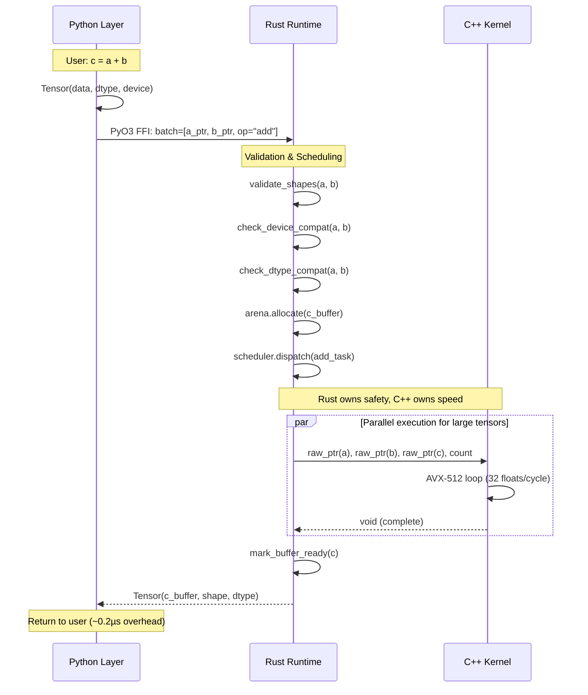

# Execution Model: Python → Rust → C++

**Version**: 0.2.0  
**Status**: Canonical Architecture Contract  
**Scope**: CPU (fully defined), GPU (architectural only)  
**Out of Scope**: Autograd, distributed execution, compiler IR

---

## Overview

This document defines the **strict execution model** for Corepy tensor operations. It is the canonical contract that all implementations must follow.

### Core Principle

```
Python (UX Layer) → Rust (Controller) → C++ (Executor)
     ↓                    ↓                   ↓
  Intent            Authority            Muscle
```

**Execution Flow Rules:**
1. **Strict layering**: Python → Rust → C++ (no layer bypassing)
2. **Single authority**: Rust is the sole execution controller
3. **Clear boundaries**: Each layer has distinct, non-overlapping responsibilities

---

## Execution Flow Diagram



---

## Layer Responsibilities

### 1. Python Layer (Skin/UX)

**Purpose**: User-facing API for expressing tensor operations  
**Implementation**: `corepy/` Python package  
**Dependencies**: NumPy-like interface conventions

#### Allowed Responsibilities

✅ **Tensor creation**
```python
# User intent: Create a tensor
import corepy as cp
a = cp.tensor([1, 2, 3], dtype='f32', device='cpu')
```

✅ **Shape/dtype specification**
```python
# Declare what the user wants
b = cp.zeros((100, 100), dtype='f64')
```

✅ **Operation intent**
```python
# Express high-level operations
c = a + b  # Intent: element-wise addition
d = a @ b  # Intent: matrix multiplication
```

✅ **Device detection**
```python
# Query available hardware
from corepy.backend import detect_devices
info = detect_devices()
print(f"AVX2: {info.has_avx2}, GPUs: {info.gpu_count}")
```

✅ **Backend selection**
```python
# Manual backend control (advanced users)
from corepy.backend import select_backend
backend = select_backend("cpu_simd")
```

#### Forbidden Operations

❌ **Math execution**
```python
# BAD: Python should NOT compute math
# This belongs in C++
for i in range(len(a)):
    c[i] = a[i] + b[i]  # WRONG LAYER
```

❌ **Threading/parallelism**
```python
# BAD: Python should NOT manage threads
# This belongs in Rust
with ThreadPoolExecutor() as pool:
    pool.map(compute, chunks)  # WRONG LAYER
```

❌ **Hot buffer allocation**
```python
# BAD: Python should NOT allocate in tight loops
# This belongs in Rust
for _ in range(1000):
    temp = [0] * size  # WRONG LAYER
```

❌ **Direct FFI calls**
```python
# BAD: Python should NOT call C++ directly
# Must go through Rust
ctypes.CDLL("libcorepy.so").add(...)  # BYPASS DETECTED
```

#### Implementation Hints

- Use PyO3 for Rust FFI (`from _corepy_rust import execute_op`)
- Keep Python-side validation minimal (defer to Rust)
- Batch operations when possible to reduce FFI overhead

---

### 2. Rust Layer (Brain/Auditor)

**Purpose**: Execution controller and safety boundary  
**Implementation**: `rust/corepy-runtime/`  
**Dependencies**: PyO3 (Python FFI), rayon (threading), libc (C++ FFI)

#### Allowed Responsibilities

✅ **Tensor validation**
```rust
// Ensure tensors are compatible
fn validate_binary_op(a: &Tensor, b: &Tensor) -> Result<()> {
    ensure!(a.shape == b.shape, "Shape mismatch");
    ensure!(a.dtype == b.dtype, "Dtype mismatch");
    ensure!(a.device == b.device, "Device mismatch");
    Ok(())
}
```

✅ **Memory lifetime management**
```rust
// Rust owns all buffer lifetimes
pub struct Arena {
    pools: Vec<MemoryPool>,
    alignment: usize,  // 64-byte for AVX-512
}

impl Arena {
    pub fn allocate(&mut self, size: usize) -> *mut u8 {
        // NUMA-aware, aligned allocation
        self.pools[0].allocate_aligned(size, self.alignment)
    }
}
```

✅ **FFI batching**
```rust
// Batch multiple ops into single FFI call
#[pyfunction]
pub fn execute_batch(ops: Vec<Operation>) -> PyResult<Vec<Tensor>> {
    // Single FFI crossing for multiple operations
    ops.into_iter()
        .map(|op| execute_single(op))
        .collect()
}
```

✅ **Execution scheduling**
```rust
// Work-stealing scheduler using rayon
pub struct TaskScheduler {
    pool: rayon::ThreadPool,
}

impl TaskScheduler {
    pub fn dispatch(&self, task: Task) -> Result<()> {
        self.pool.install(|| {
            task.execute()  // Dispatches to C++
        })
    }
}
```

✅ **Backend dispatch**
```rust
// Route to correct backend based on device
pub fn dispatch_kernel(
    op: Operation,
    device: Device,
) -> Result<Tensor> {
    match device {
        Device::CPU => cpu_backend::execute(op),
        Device::GPU(id) => gpu_backend::execute(op, id),
    }
}
```

✅ **Safety enforcement**
```rust
// Enforce Send/Sync bounds for thread safety
fn execute_parallel<T: Send + Sync>(
    data: &[T],
    func: impl Fn(&T) -> T + Sync,
) -> Vec<T> {
    data.par_iter().map(func).collect()
}
```

#### Forbidden Operations

❌ **Hot math loops**
```rust
// BAD: Rust should NOT do element-wise math
// This belongs in C++
for i in 0..n {
    c[i] = a[i] + b[i];  // WRONG LAYER
}
```

❌ **Per-element validation**
```rust
// BAD: Validate once, not per element
for elem in tensor.iter() {
    ensure!(elem.is_finite(), "Invalid");  // TOO EXPENSIVE
}
```

❌ **Decision-making in hot paths**
```rust
// BAD: Decide before loop, not inside
for chunk in chunks {
    let backend = select_backend(...);  // WRONG PLACEMENT
    backend.execute(chunk);
}
```

#### Implementation Hints

- Use PyO3 `#[pyfunction]` for FFI exports
- Use rayon for work-stealing parallelism
- Pass raw pointers to C++ via `extern "C"` FFI
- Use `#[repr(C)]` for C-compatible structs
- Validate once at operation start, trust in hot loops

---

### 3. C++ Layer (Muscle)

**Purpose**: Pure execution engine for compute-heavy operations  
**Implementation**: `csrc/` (CPU kernels), future `cuda/` (GPU kernels)  
**Dependencies**: SIMD intrinsics, CUDA (future)

#### Allowed Responsibilities

✅ **SIMD CPU kernels**
```cpp
// Pure compute, no safety checks
extern "C" void add_f32_avx512(
    const float* a,
    const float* b,
    float* c,
    size_t count
) {
    // Trust Rust: pointers are valid, aligned, non-overlapping
    for (size_t i = 0; i < count; i += 16) {
        __m512 va = _mm512_load_ps(a + i);
        __m512 vb = _mm512_load_ps(b + i);
        __m512 vc = _mm512_add_ps(va, vb);
        _mm512_store_ps(c + i, vc);
    }
}
```

✅ **GPU kernels (future)**
```cpp
// CUDA kernel for element-wise add
__global__ void add_f32_cuda(
    const float* a,
    const float* b,
    float* c,
    size_t count
) {
    size_t idx = blockIdx.x * blockDim.x + threadIdx.x;
    if (idx < count) {
        c[idx] = a[idx] + b[idx];
    }
}
```

✅ **Raw pointer arithmetic**
```cpp
// Pointer manipulation for performance
inline void process_aligned(
    const float* __restrict__ src,
    float* __restrict__ dst,
    size_t count
) {
    // __restrict__ tells compiler: no aliasing
    for (size_t i = 0; i < count; ++i) {
        dst[i] = src[i] * 2.0f;
    }
}
```

✅ **SIMD intrinsics**
```cpp
// Direct use of CPU vector instructions
#include <immintrin.h>  // AVX-512
#include <arm_neon.h>   // ARM NEON

#ifdef __AVX512F__
    // Use AVX-512 (32 floats at once)
#elif __AVX2__
    // Use AVX2 (8 floats at once)
#elif __ARM_NEON
    // Use NEON (4 floats at once)
#endif
```

#### Forbidden Operations

❌ **Safety checks**
```cpp
// BAD: C++ should NOT validate
// Rust already did this
extern "C" void add_f32(const float* a, const float* b, float* c, size_t n) {
    if (!a || !b || !c) return;  // WRONG LAYER (Rust's job)
    if (n == 0) return;           // WRONG LAYER (Rust's job)
    // ...
}
```

❌ **Memory management**
```cpp
// BAD: C++ should NOT allocate
// Rust manages lifetimes
float* result = new float[size];  // WRONG LAYER
// Use pre-allocated buffer from Rust instead
```

❌ **Python awareness**
```cpp
// BAD: C++ should NOT know about Python
#include <Python.h>  // FORBIDDEN
PyObject* obj = ...  // WRONG LAYER
```

❌ **Execution order decisions**
```cpp
// BAD: C++ should NOT decide what to execute
// Rust schedules, C++ executes
if (should_parallelize) {
    parallel_add(...);  // WRONG LAYER (Rust decides)
} else {
    serial_add(...);
}
```

#### Implementation Hints

- Mark all kernel functions `extern "C"` for Rust FFI
- Use `__restrict__` for pointer aliasing hints
- Trust Rust: no null checks, no bounds checks
- Optimize for cache lines (64 bytes)
- Use `#ifdef` for SIMD feature detection

---

## Execution Examples

### Example 1: Element-wise Addition (CPU)

```python
# PYTHON LAYER: User intent
import corepy as cp
a = cp.tensor([1.0, 2.0, 3.0], dtype='f32')
b = cp.tensor([4.0, 5.0, 6.0], dtype='f32')
c = a + b  # High-level operation
```

```rust
// RUST LAYER: Validation & dispatch
#[pyfunction]
fn tensor_add(a: &Tensor, b: &Tensor) -> PyResult<Tensor> {
    // 1. Validate
    ensure!(a.shape == b.shape, "Shape mismatch");
    ensure!(a.dtype == DType::F32, "Expected f32");
    
    // 2. Allocate output
    let c_buffer = arena.allocate(a.size_bytes());
    
    // 3. Dispatch to C++
    unsafe {
        add_f32_avx512(
            a.data_ptr() as *const f32,
            b.data_ptr() as *const f32,
            c_buffer as *mut f32,
            a.len(),
        );
    }
    
    // 4. Return tensor
    Ok(Tensor::from_raw(c_buffer, a.shape.clone(), DType::F32))
}
```

```cpp
// C++ LAYER: Pure execution
extern "C" void add_f32_avx512(
    const float* a,
    const float* b,
    float* c,
    size_t count
) {
    // No checks - trust Rust
    for (size_t i = 0; i < count; i += 16) {
        __m512 va = _mm512_load_ps(a + i);
        __m512 vb = _mm512_load_ps(b + i);
        __m512 vc = _mm512_add_ps(va, vb);
        _mm512_store_ps(c + i, vc);
    }
}
```

---

### Example 2: Matrix Multiplication (Future - Parallelized)

```python
# PYTHON LAYER: User intent
A = cp.randn((1000, 1000), dtype='f32')
B = cp.randn((1000, 1000), dtype='f32')
C = A @ B  # Matrix multiplication
```

```rust
// RUST LAYER: Scheduling & tiling
#[pyfunction]
fn matmul(a: &Tensor, b: &Tensor) -> PyResult<Tensor> {
    // 1. Validate shapes
    ensure!(a.shape[1] == b.shape[0], "Invalid shapes for matmul");
    
    // 2. Allocate output
    let (m, k) = (a.shape[0], a.shape[1]);
    let n = b.shape[1];
    let c_buffer = arena.allocate(m * n * size_of::<f32>());
    
    // 3. Tile and parallelize
    let tile_size = 64;
    (0..m).into_par_iter().for_each(|i| {
        for j in (0..n).step_by(tile_size) {
            unsafe {
                matmul_tile_avx512(
                    a.data_ptr().add(i * k) as *const f32,
                    b.data_ptr().add(j) as *const f32,
                    c_buffer.add(i * n + j) as *mut f32,
                    k, tile_size,
                );
            }
        }
    });
    
    Ok(Tensor::from_raw(c_buffer, vec![m, n], DType::F32))
}
```

```cpp
// C++ LAYER: Tiled GEMM kernel
extern "C" void matmul_tile_avx512(
    const float* a_row,
    const float* b_col,
    float* c_tile,
    size_t k,
    size_t tile_size
) {
    // Compute single tile (64x64 typical)
    // Uses AVX-512 FMA instructions
    // Blocked for L1 cache efficiency
    for (size_t i = 0; i < tile_size; ++i) {
        for (size_t j = 0; j < tile_size; j += 16) {
            __m512 sum = _mm512_setzero_ps();
            for (size_t p = 0; p < k; ++p) {
                __m512 a_val = _mm512_set1_ps(a_row[i * k + p]);
                __m512 b_val = _mm512_load_ps(&b_col[p * tile_size + j]);
                sum = _mm512_fmadd_ps(a_val, b_val, sum);
            }
            _mm512_store_ps(&c_tile[i * tile_size + j], sum);
        }
    }
}
```

---

### Example 3: GPU Execution (Future - Architectural)

```python
# PYTHON LAYER: Specify GPU device
a = cp.tensor([1, 2, 3], device='cuda:0')
b = cp.tensor([4, 5, 6], device='cuda:0')
c = a + b  # Executes on GPU
```

```rust
// RUST LAYER: GPU dispatch
#[pyfunction]
fn tensor_add_gpu(a: &Tensor, b: &Tensor) -> PyResult<Tensor> {
    // 1. Validate device compatibility
    ensure!(a.device == b.device, "Tensors on different devices");
    ensure!(matches!(a.device, Device::GPU(_)), "Expected GPU tensor");
    
    // 2. Allocate GPU buffer
    let c_buffer = cuda_malloc(a.size_bytes())?;
    
    // 3. Launch CUDA kernel
    let grid_size = (a.len() + 255) / 256;
    let block_size = 256;
    
    unsafe {
        add_f32_cuda<<<grid_size, block_size>>>(
            a.data_ptr() as *const f32,
            b.data_ptr() as *const f32,
            c_buffer as *mut f32,
            a.len(),
        );
        cuda_device_synchronize();
    }
    
    Ok(Tensor::from_raw_gpu(c_buffer, a.shape.clone(), a.device))
}
```

```cpp
// C++ LAYER: CUDA kernel
__global__ void add_f32_cuda(
    const float* a,
    const float* b,
    float* c,
    size_t count
) {
    size_t idx = blockIdx.x * blockDim.x + threadIdx.x;
    if (idx < count) {
        c[idx] = a[idx] + b[idx];  // Massively parallel
    }
}
```

---

## Cross-References

### Related Documentation

- [backend_architecture.md](file:///home/crazyguy/VSCode/corepy/docs/backend_architecture.md) - Backend selection, device detection, Rust runtime features
- [ARCHITECTURE_VISION.md](file:///home/crazyguy/VSCode/corepy/ARCHITECTURE_VISION.md) - Long-term vision and design principles
- [COREPY_V1_REVIEW.md](file:///home/crazyguy/VSCode/corepy/COREPY_V1_REVIEW.md) - Current implementation status

### Implementation Locations

- **Python API**: `corepy/*.py`
- **Rust Runtime**: `rust/corepy-runtime/src/`
- **C++ Kernels**: `csrc/`
- **FFI Bindings**: `bindings/`

---

## Design Principles

### 1. Trust the Layer Below
- Python trusts Rust to execute correctly
- Rust trusts C++ to execute correctly
- C++ trusts it receives valid inputs

### 2. Validate Once, Execute Many
- Validation happens at operation entry (Rust)
- Hot loops have zero validation overhead (C++)

### 3. Each Layer Owns Its Domain
- Python: User experience
- Rust: Correctness and safety
- C++: Performance

### 4. No Bypass Allowed
- Every operation flows through all three layers
- Direct Python → C++ calls are forbidden
- Rust is the non-negotiable gatekeeper

---

## FAQ

**Q: Why can't Python call C++ directly for performance?**  
A: Rust provides memory safety, thread safety, and lifetime management. Bypassing Rust would reintroduce segfaults and data races that NumPy/PyTorch suffer from.

**Q: Isn't Rust overhead too expensive?**  
A: Rust's zero-cost abstractions compile to native code. The overhead is FFI crossings, which are batched. For large tensors, this is negligible (<1% total time).

**Q: Can C++ validate inputs for safety?**  
A: No. C++ is the hot path. Validation must happen in Rust before dispatch. C++ trusts its inputs are valid.

**Q: Where do GPU kernels fit?**  
A: Same model. Python → Rust (validates + launches CUDA kernel) → C++ CUDA code (executes on GPU).

**Q: What about JIT compilation?**  
A: Future scope. JIT would sit in Rust layer, generating C++/LLVM IR, which is then executed. The 3-layer model still applies.

**Q: How does this compare to PyTorch's execution model?**  
A: PyTorch uses Python → C++ ATen directly. Corepy adds Rust as a safety layer, preventing entire classes of bugs (UAF, data races, memory leaks).

---

**Last Updated**: 2026-01-27  
**Maintainer**: Vipin  
**Status**: Canonical Contract (all implementations must comply)
